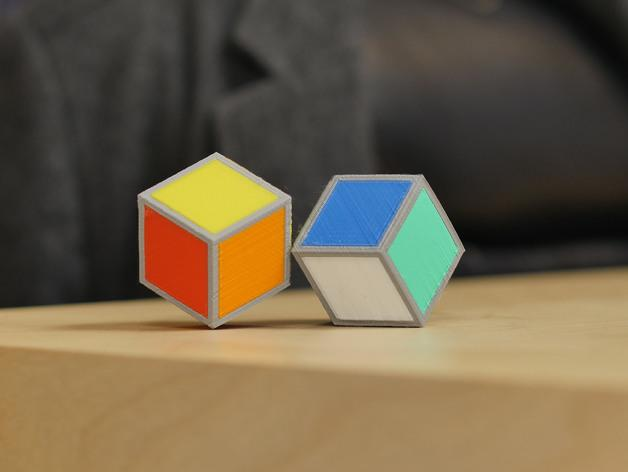

# PLA

Northworks PLA Print Guide

January 14, 2021

## 

### Overview

PLA \(Polylactic Acid\), is probably the most commonly used filament for 3D printing because it is relatively inexpensive, forgiving, prints at fairly low temperatures and does not require a heated bed. Parts made from Northworks PLA are great for prototyping and are useful in many applications. Derived from plants and biodegradable, it is one of the most environmentally friendly filaments available. Post processing options are somewhat more limited than other materials, but include heat treating for greater temperature resistance, abrasion and coating. PLA works well with the MC option for multicolor printing and is compatible with PVA dissolvable supports using either dual heads or the MC option.

### Print Conditions

| **Environment Conditions** | **Extrusion** | **Other:** |
| :--- | :--- | :--- |
| **Surface:** PEI \(recommended\), Glass or Paper | **Speed:** 3600mm/min for best quality, though speeds up to 10,000 mm/min are possible with the smaller nozzles | **Cooling Fan:** 100% after first layer |
| **Bed Temperature:** 60 °C | **Temperature:** 195 - 205 °C standard \(Note: increase by 5 °C for each 1000mm/min above 4000\) | **PLA - PLA MC Splice:** 1,0,1 |
| **Cabinet:** Ambient | **Retraction:** 3mm |  |
|  | **Nozzles:** 0.25, 0.4, 0.8, 1.2 |  |

### **Pros Cons**

| ✔ | Low cost | ✘ | Low temperature resistance |
| :--- | :--- | :--- | :--- |
| ✔ | Stiff and fairly strong | ✘ | Moderate oozing and stringing possible, especially with high volume hot end |
| ✔ | Good dimensional accuracy | ✘ | Old filament may become brittle |
| ✔ | Easy to print | ✘ | Not suitable for parts exposed to the elements |
| ✔ | Compatible with several other filaments with MC option |  |  |
| ✔ | Fair shelf life \(hygroscopic, but can be dehydrated\) |  |  |

### 

### Tips and Tricks

**Cooling**

Cooling is one of the most important parameters printing with PLA. The freshly extruded plastic needs to cool below the glass transition temperature as quickly as possible to minimize stringing and deformation. Generally set the fan to 100% throughout the print, except for the first layer, where you want to form a strong bond with the bed. It may also be appropriate to reduce the print speed for small parts, or set the minimum layer time sufficiently high to ensure that the layers have sufficient time to cool. This can greatly improve the print quality by allowing each layer to fully solidify before moving on to the next.

**Oozing**

A common problem with PLA is oozing. Since the filament flows relatively easily, it has a tendency to continue flowing during travel between extrusions. This creates strings or hairs that may be problematic Retraction settings and temperature management are the best ways to manage stringing. Different print conditions may need slightly different settings, so you may need to experiment to find the best settings in a given situation.

**Extruder Temperature:**

Printing at the right temperature is important for any print, and many variables can interact to change the optimum. Incorrect temperature can lead to problems with oozing, stringing, and under-extrusion. If you have trouble with stringing, try reducing the temperature by 5-10 degrees, which will help prevent the excess oozing. If you’re struggling with under-extrusion, try increasing the temperature by 10 degrees so that the material flows more easily through the nozzle. In general higher plastic flow rates also require higher temperatures, especially with larger nozzles and print speeds above 4,000 mm/min. For instance when producing large objects it is possible to print at up to 8,000 mm/min speed with a 0.8 mm nozzle, but this is more than 10 times the flow rate of a “normal” print and the correct nozzle temperature may be as much as 40 °C above the recommendations given above.

**Slicing Options:**

Northworks PLA prints well with most common combinations of nozzle size, layer height and infill. Typically layer heights between 25% - 60% of nozzle diameter, and line widths between 100% - 140% of nozzle diameter work best. Adding additional solid layers to the top and bottom, and additional perimeters, will increase strength at cost of print time. Generally it is a good idea to include a skirt \(detached or attached to the part\) to help prime the extruder.

**Post Processing:**

Parts printed with Northworks PLA can be sanded to remove strings and minor defects, but as with all PLA it does not work well to clean up layer lines. There are many surface coating options available. PLA supports work well and are generally fairly easy to remove with pliers, but will leave scars.

**Multi-material Printing:**

Northworks PLA comes in a variety of colors that can be mixed in a single print either by utilizing the dual extruders \(2 colors\) or on our MC printers up to 5 colors. PVA is compatible with either option as a dissolvable support material. Other combinations such as PLA/TPU or PLA/ABS are possible, but this is an advanced capability not covered in this document.

safda

